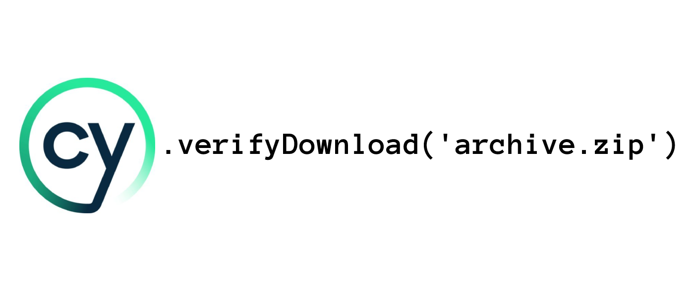

[](https://vshymanskyy.github.io/StandWithUkraine)

# cy-verify-downloads  [](https://www.npmjs.com/package/cy-verify-downloads)

<div align="center">

<p>Custom Cypress command to wait and verify that file is downloaded.</p>
</div>

## Installation

```shell
npm i -D cy-verify-downloads
```

## Extend Cypress command

This package extends Cypress' `cy` command.

**For Cypress v10+:**

Add this line to your project's `cypress/support/e2e.js`:

```javascript
require('cy-verify-downloads').addCustomCommand();
```

Then you need to add the following lines of code to your project's `cypress.config.js`:

```javascript
const { verifyDownloadTasks } = require('cy-verify-downloads');

module.exports = defineConfig({
  e2e: {
    setupNodeEvents(on, config) {
      on('task', verifyDownloadTasks);
    },
  },
});
```

**For Cucumber:**

Additionally, you may need to install and add node polyfill in your `support/e2e.js` file:

1. Install the polyfill module:

```bash
npm i -D esbuild-plugin-polyfill-node
```
2. Import the following code in your `support/e2e.js` file:

```js
const { polyfillNode } = require('esbuild-plugin-polyfill-node');
```

3. Add the following code in your `plugins` property:

```js
module.exports = defineConfig({
  e2e: {
    async setupNodeEvents(on, config) {
      const bundler = createBundler({
        plugins: [polyfillNode({ polyfills: { crypto: true } }), createEsbuildPlugin(config)],
      });
    }
  }
});
```

**For Cypress v9:**

So, you need to add this line to your project's `cypress/support/commands.js`:

```javascript
require('cy-verify-downloads').addCustomCommand();
```

And add the following lines to your project's `cypress/plugins/index.js`:

```javascript
const { verifyDownloadTasks } = require('cy-verify-downloads');

module.exports = (on, config) => {
  on('task', verifyDownloadTasks)
}
```

## Usage

Then, in your test, you can use it like this:

```javascript
cy.verifyDownload('picture.png');

// verify download by file extension or partial filename
cy.verifyDownload('.png', { contains: true });
cy.verifyDownload('pic', { contains: true });

// or increase timeout
cy.verifyDownload('archive.zip', { timeout: 25000 });

// or increase timeout and interval pooling
cy.verifyDownload('archive.zip', { timeout: 25000, interval: 600 });
```

## Types


To enable IntelliSense information and autocomplete you have to include types in the `tsconfig.json` file:

```json
{
  "compilerOptions": {
    "types": ["cypress", "cy-verify-downloads"]
  }
}
```

## Author

Yevhen Laichenkov <elaichenkov@gmail.com>

## License

[MIT](LICENSE)
